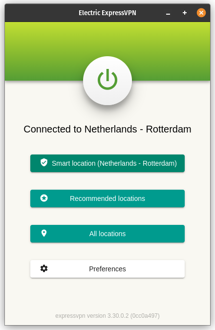
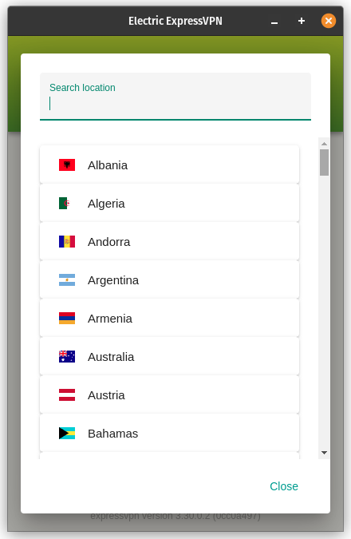
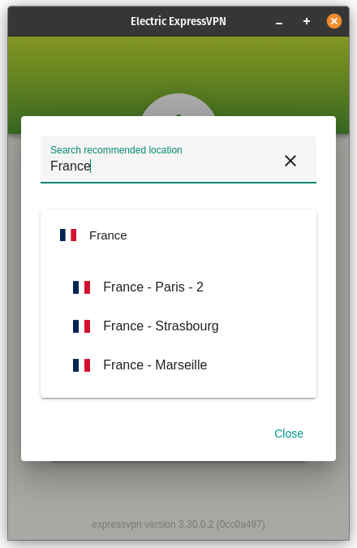
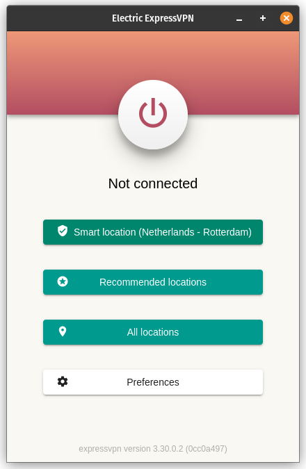
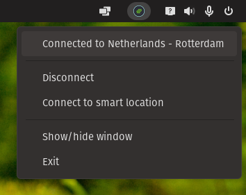
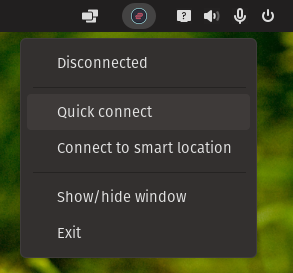
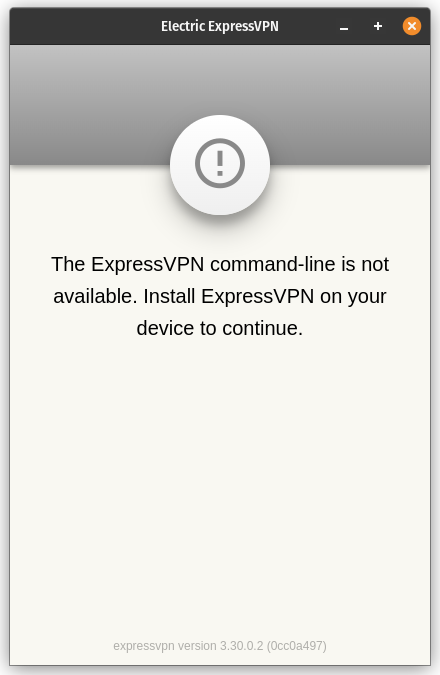
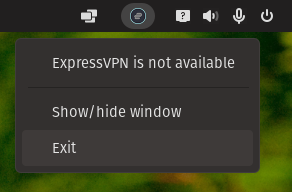
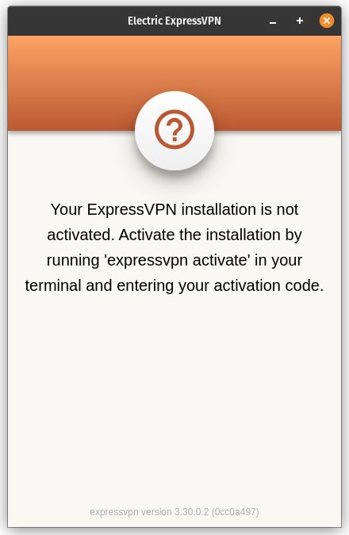
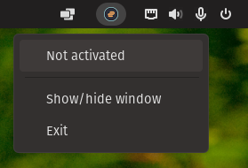

# Electric ExpressVPN

Electric ExpressVPN is an ExpressVPN client for linux made using Angular and Electron, based on the [angular-electron](https://github.com/maximegris/angular-electron) boilerplate. 

## Features
- Compact resizable window
- Show current connection status
- Quick connect (connect to last location or smart location)
- Disconnect
- Connect to smart location
- Connect to a (recommended) location
- Search location by country or location name
- Show ExpressVPN version
- Set ExpressVPN preferences
- Client preferences
    - Minimize to tray
    - Start Minimized
- Tray icon
    - Show connection status
    - Disconnect / quick connect
    - Connect to smart location
    - Show / hide application
    - Exit application

## Running and installing

### Prerequisites

- libappindicator1
- ExpressVPN command line installed and activated

### Running the application

- Grab the latest release from the [releases page](https://github.com/msbb/electric-expressvpn/releases)
- Open a terminal
- Navigate to the directory where you saved the file (i.e. `cd /home/USER_NAME/Applications/`)
- Mark the file as executable using `chmod` (i.e. `chmod +x electric-expressvpn-1.0.0.AppImage`)
- Run the file (i.e. `./electric-expressvpn-1.0.0.AppImage`)

### Installing the application

- To integrate the application into your OS installation, I would advise using [AppImageLauncher](https://github.com/TheAssassin/AppImageLauncher)

### Run application on startup

- To run Electric ExpressVPN on startup, add a startup command pointing to the saved `.AppImage` file:
    - `/home/USER_NAME/Applications/electric-expressvpn-1.0.0.AppImage`

## Issues

### Known issues

- The tray icon flashes on changing state

### Contributing issues

If you run into any issues while using this application, please open a new issue on the [issues page](https://github.com/msbb/electric-expressvpn/issues). Clearly describe what problem occurs in what situation, what version of the ExpressVPN command line you are using, and what version of the Electric ExpressVPN client you are using.

## Contributing

In order to contribute, fork this repository, make your changes and add a pull request to this repository. Prefix your pull request name either with `feature/` or `bugfix/`, and your pull request title with `feat:` or `fix:`. 

In your pull request description, clearly describe the aim of the pull request. Add the maintainer of this repository as a reviewer.

Make sure there are no linting errors in your code by running `npm run lint` before submitting the pull request.

## Other operating systems

Since this application was developed using Electron, it might work on other operating systems. This has not been tested, since Windows and macOS already have dedicated ExpressVPN clients. To test this, clone this project, and run `npm install` and `electron:build` from the project root, from the OS you would like to build it for.

## Screenshots

